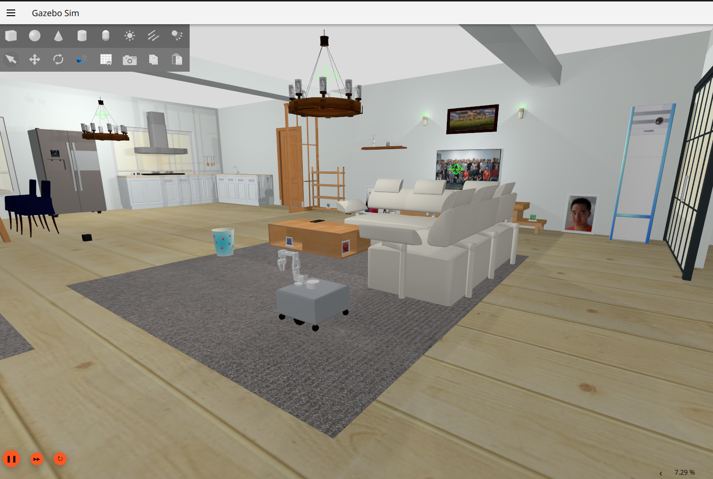
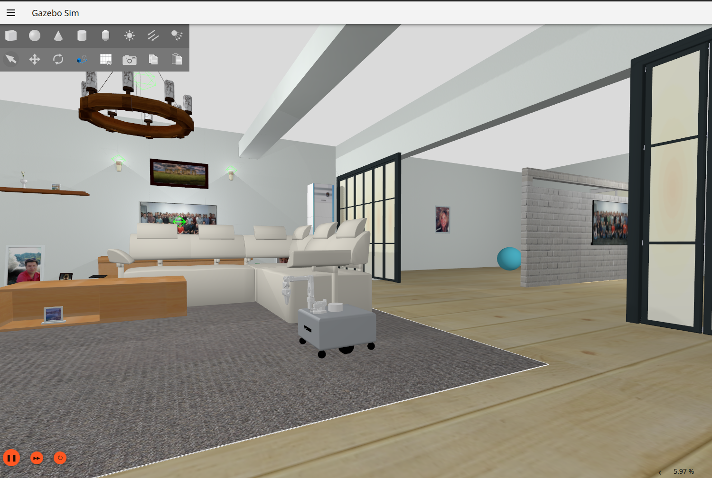
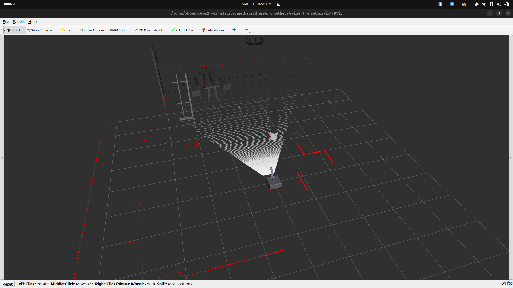
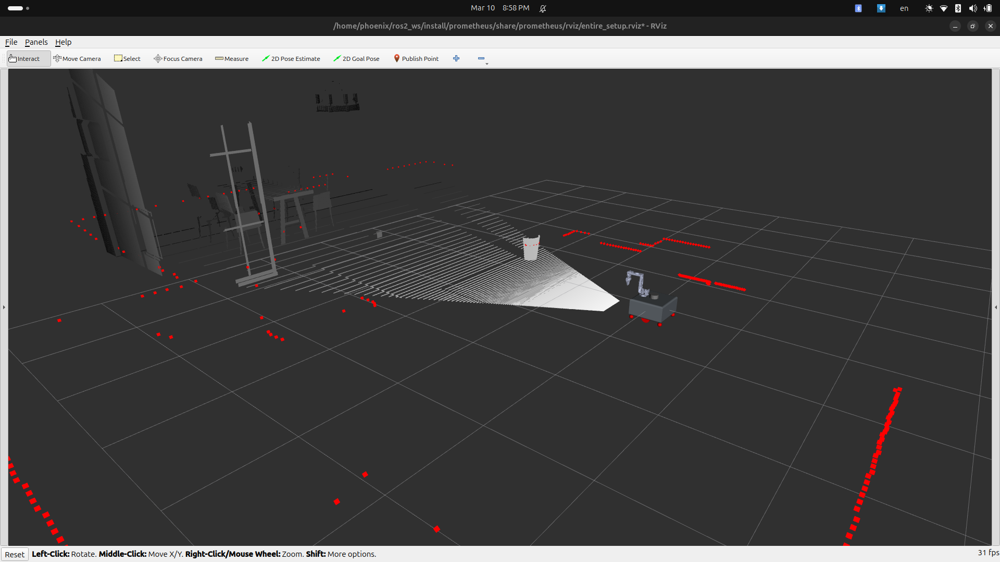

# prometheus DiffDrive Robot

<https://github.com/bruk/prometheus/assets/>

## About

This repository contains a Gazebo and Isaac Sim simulation for a differential drive robot, equipped with an IMU, a depth camera, stereo camera and a 2D LiDAR. The primary contriution of this project is to support multiple ROS and Gazebo distros. Currently, the project supports the following versions -

1. [ROS2 Humble/Jazzy with Gazebo Harmonic](#humble--harmonic-ubuntu-2204)

Each of the following sections describes depedencies, build and run instructions for each of the above combinations

## ROS2 Humble/Jazzy with Gazebo Harmonic

### Dependencies

- [AWS RoboMaker Small House World ROS package](https://github.com/aws-robotics/aws-robomaker-small-house-world)
```bash
sudo apt-get install ros-humble-ros-gzharmonic
```

```bash
# From the root directory of the workspace. This will install everything mentioned in package.xml
rosdep install --from-paths src/prometheus --ignore-src -r -y
```

### Build

```bash
colcon build --packages-select prometheus
```

### Run

To launch the robot in Gazebo,

```bash
ros2 launch prometheus gz.launch.py
```

To view in rviz,

```bash
ros2 launch prometheus rviz.launch.py
```

### Configuration

The launch file accepts multiple launch arguments,

```bash
ros2 launch prometheus gz.launch.py \
 arm_enabled:=True \
 camera_enabled:=True \
 stereo_camera_enabled:=False \
 two_d_lidar_enabled:=True \
 position_x:=0.0 \
 position_y:=0.0  \
 orientation_yaw:=0.0 \
 odometry_source:=world \
 world_file:=small_warehouse.sdf
```

### Mapping with SLAM Toolbox

SLAM Toolbox is an open-source package designed to map the environment using laser scans and odometry, generating a map for autonomous navigation.

NOTE: The command to run mapping is common between all versions of gazebo.

To start mapping:

```bash
ros2 launch prometheus mapping.launch.py
```

Use the teleop twist keyboard to control the robot and map the area:

```bash
ros2 run teleop_twist_keyboard teleop_twist_keyboard cmd_vel:=/prometheus/cmd_vel
```

To save the map:

```bash
cd src/prometheus/config
ros2 run nav2_map_server map_saver_cli -f map
```

### Using Nav2 with prometheus

Nav2 is an open-source navigation package that enables a robot to navigate through an environment easily. It takes laser scan and odometry data, along with the map of the environment, as inputs.

NOTE: The command to run navigation is common between all versions of gazebo and Isaac sim.

To run Nav2 on prometheus:

```bash
ros2 launch prometheus nav2.launch.py
```

### Arm Inverse Kinematics with Pink-IK

The SO-100 5-DOF arm can be controlled via task-space (Cartesian) goals using [Pink](https://github.com/stephane-caron/pink), a Python inverse kinematics library built on [Pinocchio](https://github.com/stack-of-tasks/pinocchio).

#### Arm Controllers

The arm uses `ros2_control` with the following controllers:

| Controller | Type | Purpose |
|---|---|---|
| `joint_state_broadcaster` | JointStateBroadcaster | Publishes joint states |
| `joint_trajectory_controller` | JointTrajectoryController | Position control for 5 arm joints |
| `gripper_controller` | GripperActionController | Gripper open/close |

Arm joints: `Shoulder_Rotation`, `Shoulder_Pitch`, `Elbow`, `Wrist_Pitch`, `Wrist_Roll`

#### Dependencies

```bash
pip install pin-pink quadprog "numpy<2"
```

> **Note:** `numpy<2` is required because the ROS Jazzy system Pinocchio is compiled against NumPy 1.x. The `pin-pink` package pulls NumPy 2.x by default, which causes a crash.

#### Running the IK Node

First launch the simulation:

```bash
ros2 launch prometheus gz.launch.py
```

Then launch the Pink IK node (automatically loads and activates arm controllers):

```bash
ros2 launch prometheus pink_ik.launch.py
```

To also run the test pose publisher (cycles through 5 pre-defined poses):

```bash
ros2 launch prometheus pink_ik.launch.py run_tests:=true
```

#### Sending Target Poses

Publish a `geometry_msgs/PoseStamped` to the `pink_ik/target_pose` topic. Poses are in the `base_footprint` frame:

```bash
ros2 topic pub --once pink_ik/target_pose geometry_msgs/msg/PoseStamped \
  '{header: {frame_id: "base_footprint"}, pose: {position: {x: 0.15, y: 0.0, z: 0.2}, orientation: {w: 1.0}}}'
```

#### Topics and Actions

| Topic / Action | Type | Direction |
|---|---|---|
| `pink_ik/target_pose` | `geometry_msgs/PoseStamped` | Subscribe - target EE pose |
| `pink_ik/current_ee_pose` | `geometry_msgs/PoseStamped` | Publish - current FK pose at 10 Hz |
| `pink_ik/status` | `std_msgs/String` | Publish - solver status (`idle`, `solving`, `executing`, `reached`, `failed`) |
| `joint_trajectory_controller/follow_joint_trajectory` | `FollowJointTrajectory` | Action client - sends computed trajectories |

#### Configuration

IK parameters are in `config/pink_ik_params.yaml`. Key settings:

- `position_cost` / `orientation_cost` - task weights (position prioritized since 5-DOF cannot achieve full 6-DOF poses)
- `max_iterations` / `dt` - differential IK loop settings
- `position_threshold` - convergence criterion (meters)
- `trajectory_duration` / `num_waypoints` - trajectory execution timing

### Simulation and Visualization

1. Gz Sim (small_house World):
 
 

2. Rviz (small_house World):
 
 

## Acknowledgment

this project is heavily based on the follwing repos
- [BCR_BOT](https://github.com/blackcoffeerobotics/bcr_bot)
- [SO-ARM-100](https://github.com/brukg/so-100-arm)