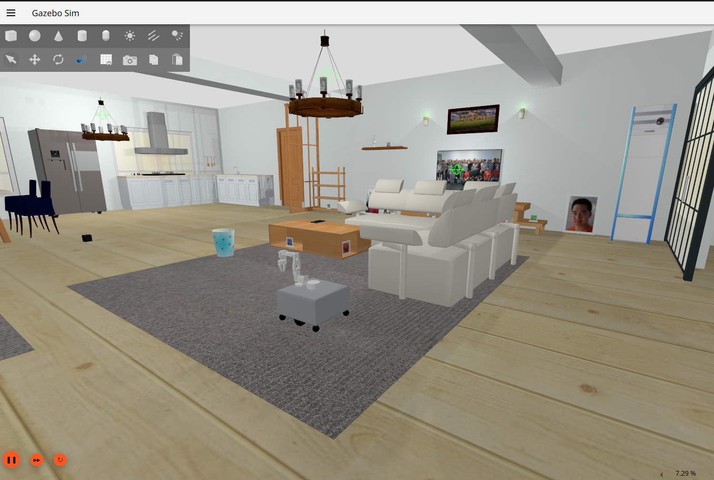
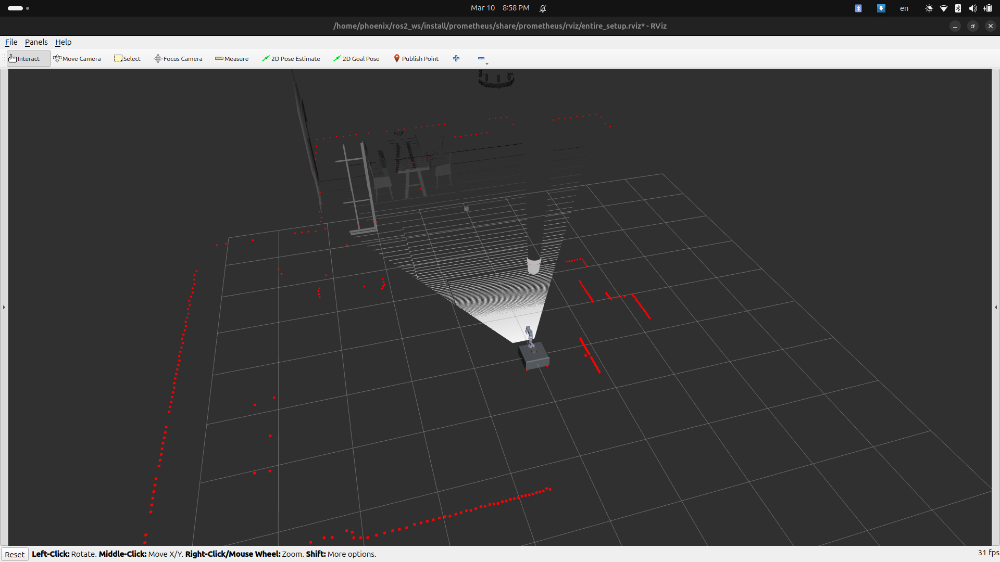
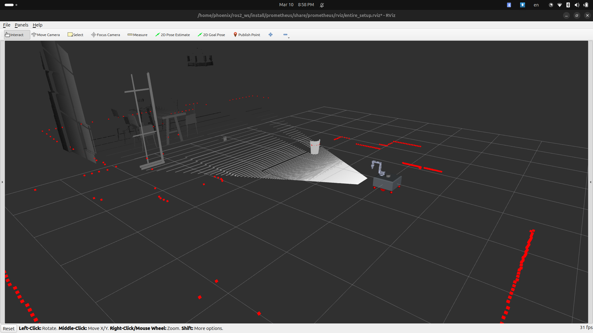

# prometheus DiffDrive Robot

<https://github.com/signalbotics/prometheus/assets/>

## About

This repository contains a Gazebo and Isaac Sim simulation for a differential drive robot, equipped with an IMU, a depth camera, stereo camera and a 2D LiDAR. The primary contriution of this project is to support multiple ROS and Gazebo distros. Currently, the project supports the following versions -

1. [ROS2 Humble/Jazzy with Gazebo Harmonic](#humble--harmonic-ubuntu-2204)

Each of the following sections describes depedencies, build and run instructions for each of the above combinations

## ROS2 Humble/Jazzy with Gazebo Harmonic

### Dependencies

- [AWS RoboMaker Small House World ROS package](https://github.com/aws-robotics/aws-robomaker-small-house-world)
```bash
sudo apt-get install ros-humble-ros-gzharmonic
```

```bash
# From the root directory of the workspace. This will install everything mentioned in package.xml
rosdep install --from-paths src/prometheus --ignore-src -r -y
```

### Build

```bash
colcon build --packages-select prometheus
```

### Run

To launch the robot in Gazebo,

```bash
ros2 launch prometheus gz.launch.py
```

To view in rviz,

```bash
ros2 launch prometheus rviz.launch.py
```

### Configuration

The launch file accepts multiple launch arguments,

```bash
ros2 launch prometheus gz.launch.py \
 arm_enabled:=True \
 camera_enabled:=True \
 stereo_camera_enabled:=False \
 two_d_lidar_enabled:=True \
 position_x:=0.0 \
 position_y:=0.0  \
 orientation_yaw:=0.0 \
 odometry_source:=world \
 world_file:=small_warehouse.sdf
```

### Mapping with SLAM Toolbox

SLAM Toolbox is an open-source package designed to map the environment using laser scans and odometry, generating a map for autonomous navigation.

NOTE: The command to run mapping is common between all versions of gazebo.

To start mapping:

```bash
ros2 launch prometheus mapping.launch.py
```

Use the teleop twist keyboard to control the robot and map the area:

```bash
ros2 run teleop_twist_keyboard teleop_twist_keyboard cmd_vel:=/prometheus/cmd_vel
```

To save the map:

```bash
cd src/prometheus/config
ros2 run nav2_map_server map_saver_cli -f map
```

### Using Nav2 with prometheus

Nav2 is an open-source navigation package that enables a robot to navigate through an environment easily. It takes laser scan and odometry data, along with the map of the environment, as inputs.

NOTE: The command to run navigation is common between all versions of gazebo and Isaac sim.

To run Nav2 on prometheus:

```bash
ros2 launch prometheus nav2.launch.py
```

### Simulation and Visualization

1. Gz Sim (small_house World):
 
 

2. Rviz (small_house World):
 
 

## Acknowledgment

this project is heavily based on the follwing repos
- [BCR_BOT](https://github.com/blackcoffeerobotics/bcr_bot)
- [SO-ARM-100](https://github.com/signalbotics/so-100-arm)